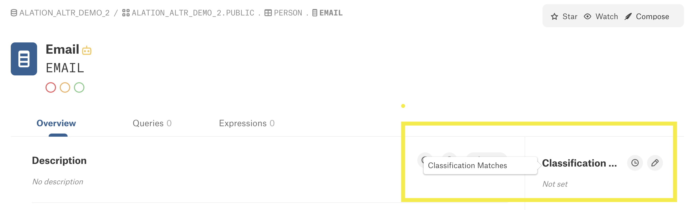
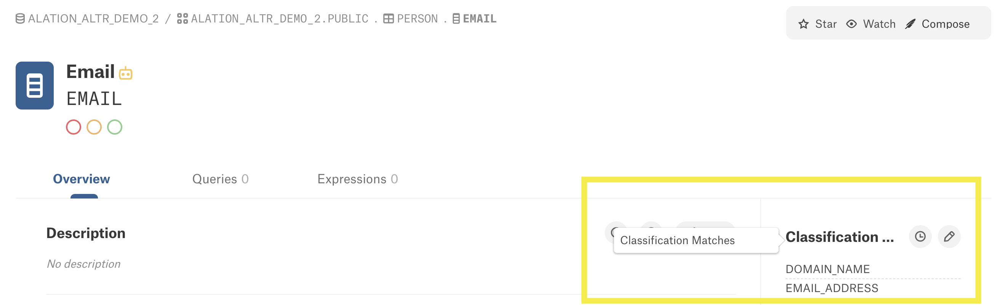

  
  

# Alation Classification Integration

The Alation Classification Integration is a tool to pass classification data of a database in ALTR into Alation.

This tool is plumbing between to available API's.
* [ALTR Management  API](https://altrnet.live.altr.com/api/swagger/)
* [Alation API](https://developer.alation.com/dev/reference/refresh-access-token-overview)

  
  

## How it works

**Prelude:** ALTR provides functionality to run data classification on a connected database. This functionality classifies columns based on the data within them.

  

The tool:

1. gets all databases from ALTR that have a classification report

2. gets the classifier(s) of said databases

3. gets the columns of said classifier(s)

4. gets corresponding Alation columns

5. updates *ALTR Classification* (Custom Field) with classifier(s) of each column

6. updates the Alation datasource page with ALTR classification report overview

  
  

## Why use it

<a  href="https://www.altr.com/">ALTR</a> partnered with <a  href="https://www.alation.com/">Alation</a> to fill a gap between data cataloging and data governance. With ALTR's powerful classification capability, you can use this tool to automatically pass classification results from ALTR in to Alation. This allows catalog admins in Alation to quickly and easily see how data is classified and make decisions based on those results.

  
  

## Visuals

Integration Flowchart:

  

  

Alation Column before running the application:

  

Alation Column after running the application:

  
  

## Installation

**Install From Source**

    $ git clone https://github.com/altrsoftware/altr-alation-classification.git

    $ cd altr-alation-classification

**Install npm packages**

    $ npm install

  
  

## Before using the tool

**1. You must add a custom field to your Alation environment for this application to work successfully**

    $ node customFieldMaker.js --domain=<Alation Domain> --account=<Alation Login Email> --password=<Alation Login Password>

1. Click the *Settings* icon at the top right of your Alation environment

2. In the *Catalog Admin* section, click *Customize Catalog*

3. Click the *Custom Templates* tab

4. Under the *Data Object Templates* section, click *Column*

5. On the right side of the template, click *Insert* -> *Custom Field* -> *ALTR Classifications*

6. At the top of the template, click *Save*

**2. Fill out the .env file environment variables**

    // ALATION
    
    ALATION_API_ACCESS_TOKEN = "Your Alation API Access Token"
    
    ALATION_DOMAIN = "Your Alation domain (example-prod.alationcatalog.com)"
    
    ALATION_EMAIL = "The email used to sign in and create the API Access Token"
    
    //ALTR
    
    ALTR_DOMAIN = "Your ALTR domain (example.live.altr.com)"
    
    ALTR_KEY_NAME = "Your ALTR API key name"
    
    ALTR_KEY_PASSWORD = "Your ALTR API key password"

  
  

## How To Use

> **Warning:**
> You must complete the **Before using the tool** section; otherwise, the integration will not work correctly.

**Method 1: <a  href="https://www.docker.com/">Docker</a>**

This method will install the necessary packages needed to run the application for you.

  

    $ docker build -t altr/alation-classification-integration .
    
    $ docker run -d altr/alation-classification-integration

  

**Method 2: Manually**

  

    $ npm install

    
    $ node index.js

  

## Dependencies

This application was built using the following node packages and their respected version:

* [axios](https://www.npmjs.com/package/axios/v/0.27.2) : 0.27.2

* [axios-cookiejar-support](https://www.npmjs.com/package/axios-cookiejar-support/v/4.0.3) : 4.0.3

* [axios-mock-adapter](https://www.npmjs.com/package/axios-mock-adapter/v/1.21.2) : 1.21.2

* [dotenv](https://www.npmjs.com/package/dotenv/v/16.0.3) : 16.0.3

* [jest](https://www.npmjs.com/package/jest/v/29.2.2) : 29.2.2
  
* [node](https://nodejs.org/download/release/v16.0.0/) : 0.27.2

* [tough-cookie](https://www.npmjs.com/package/tough-cookie/v/4.1.2) : 4.1.2

* [yargs](https://www.npmjs.com/package/yargs/v/17.6.2) : 17.6.2

  

  

## Support

Need support to get this application running? Have questions, concerns or comments?

Email *application-engineers@altr.com* with a subject line of "Alation Classification Integration Support".

  

## License

[GNU General Public License](LICENSE.md)
