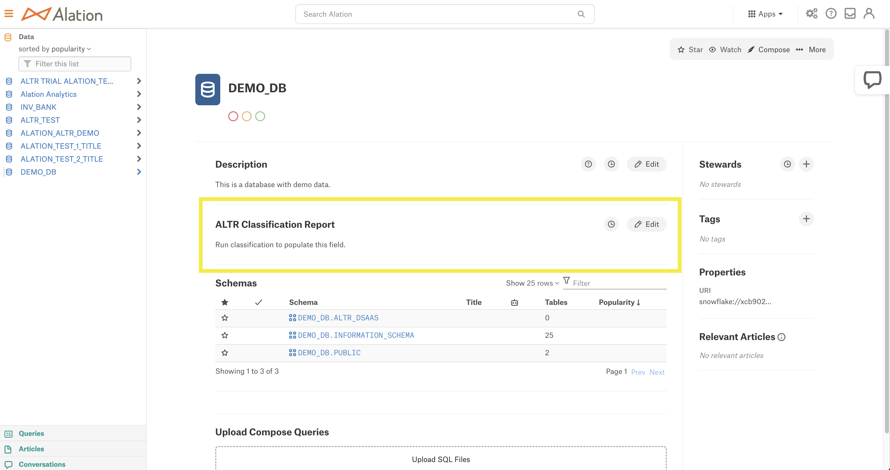

  
  

# Alation Classification Integration

    

The ALTR + Alation Classification tool is used to pass classification data from ALTR to Alation.

This tool is plumbing between two available APIs.
* [ALTR Management  API](https://altrnet.live.altr.com/api/swagger/)
* [Alation API](https://developer.alation.com/dev/reference/refresh-access-token-overview)

  
  

## How it works

**Prelude:** ALTR provides functionality to run data classification on a connected database. This functionality classifies columns based on the data within them.

  

The tool:

1. gets all databases from ALTR that have a classification report

2. gets the classifier(s) of said databases

3. gets the columns of said classifier(s)

4. gets corresponding Alation columns

5. updates *ALTR Classification* & *ALTR Classification Confidence* (Custom Fields) with classifier(s) of each column

6. updates *ALTR Classification Report* (Custom Field) in the Alation data source page with an ALTR classification report overview

  
  

## Why use it

<a  href="https://www.altr.com/">ALTR</a> partnered with <a  href="https://www.alation.com/">Alation</a> to fill a gap between data cataloging and data governance. With ALTR's powerful classification capability, you can use this tool to automatically pass classification results from ALTR into Alation. This allows catalog admins in Alation to quickly and easily see how data is classified and make decisions based on those results.

  
  

## Visuals

Integration Flowchart:

  

  

Alation data source page BEFORE running the application:

Alation data source page AFTER running the application:

Alation column page BEFORE running the application:

  

Alation column page AFTER running the application:

  
  

## Installation

**Install From Source**

	$ git clone https://github.com/altrsoftware/altr-alation-classification.git

	$ cd altr-alation-classification

**Install npm packages** (Not needed via Docker)

	$ npm install

  
  

## Before using the tool

**1. You **must add **custom fields** to your** Alation environment for this application to work successfully**

	$ node createCustomField.js --domain=<Alation Domain> --account=<Alation Login Email> --password=<Alation Login Password>

1. Click the *Settings* icon at the top right of your Alation environment

2. In the *Catalog Admin* section, click *Customize Catalog*

3. Click the *Custom Templates* tab

4. Under the *Data Object Templates* section, click *Column*

5. On the right side of the template, click *Insert* -> *Custom Field* -> *ALTR Classifications*

6. At the top of the template, click *Save*

7. Under the *Data Object Templates* section, click *Data Source*

8. Under the *Description* field, click *Insert* -> *Custom Field* -> *ALTR Classification Report*

9. Under the *ALTR Classification Report* field, click *Insert* -> *Custom Field* -> *ALTR Classification Confidence*

**2. Fill out the .env file environment variables**

	// ALATION
	ALATION_API_ACCESS_TOKEN = "Your Alation API Access Token" 
	ALATION_DOMAIN = "Your Alation domain (example-prod.alationcatalog.com)"
	ALATION_EMAIL = "The email used to sign in and create the API Access Token"

	//ALTR
	ALTR_DOMAIN = "Your ALTR domain (example.live.altr.com)"
	ALTR_KEY_NAME = "Your ALTR API key name"
	ALTR_KEY_PASSWORD = "Your ALTR API key password"

The following environment variables are found in `.env.defaults`. To change these values add the variables to `.env` with the values you want.
These variables are used to throttle API calls if you have API thresholds in Alation.

	THROTTLE_LIMIT = 20
	THROTTLE_INTERVAL_MILLISECONDS = 1000

Alation API Access Token information is found here. https://developer.alation.com/dev/docs/authentication-into-alation-apis
  

## How To Use

> **Warning:**
> You must complete the **Before using the tool** section; otherwise, the integration will not work correctly.

**Method 1: <a  href="https://www.docker.com/">Docker</a>**

This method will install the necessary packages needed to run the application for you.

	$ docker build -t altr/altr-alation-classification .  
	
	$ docker run -d altr/altr-alation-classification

  

**Method 2: Manually**

	$ npm install
	
	$ node index.js

  

## Dependencies

This application was built using the following npm packages:

* [axios](https://www.npmjs.com/package/axios/v/0.27.2)

* [axios-cookiejar-support](https://www.npmjs.com/package/axios-cookiejar-support/v/4.0.3)

* [axios-mock-adapter](https://www.npmjs.com/package/axios-mock-adapter/v/1.21.2)

* [dotenv-defaults](https://www.npmjs.com/package/dotenv-defaults)

* [jest](https://www.npmjs.com/package/jest/v/29.2.2)

* [p-throttle](https://www.npmjs.com/package/p-throttle)

* [tough-cookie](https://www.npmjs.com/package/tough-cookie/v/4.1.2)

* [yargs](https://www.npmjs.com/package/yargs/v/17.6.2)

  

  

## Support

Need support to get this application running? Have questions, concerns or comments?

Email *application-engineers@altr.com* with a subject line of "Alation Classification Integration Support".

  

## License

[GNU General Public License](LICENSE.md)

## Additional Resources
https://docs.altr.com/

https://www.youtube.com/@altrsoftware

https://www.altr.com/resources
